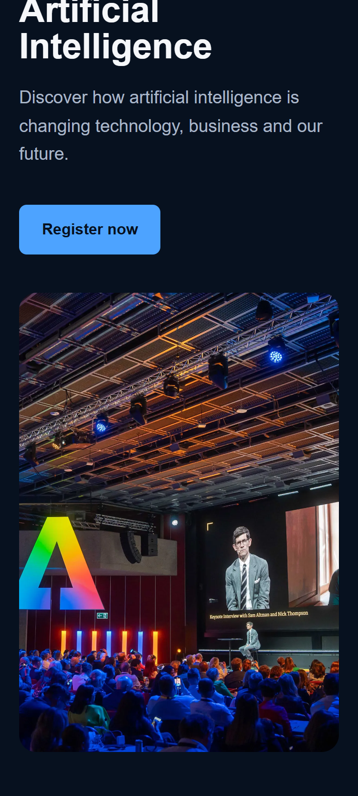
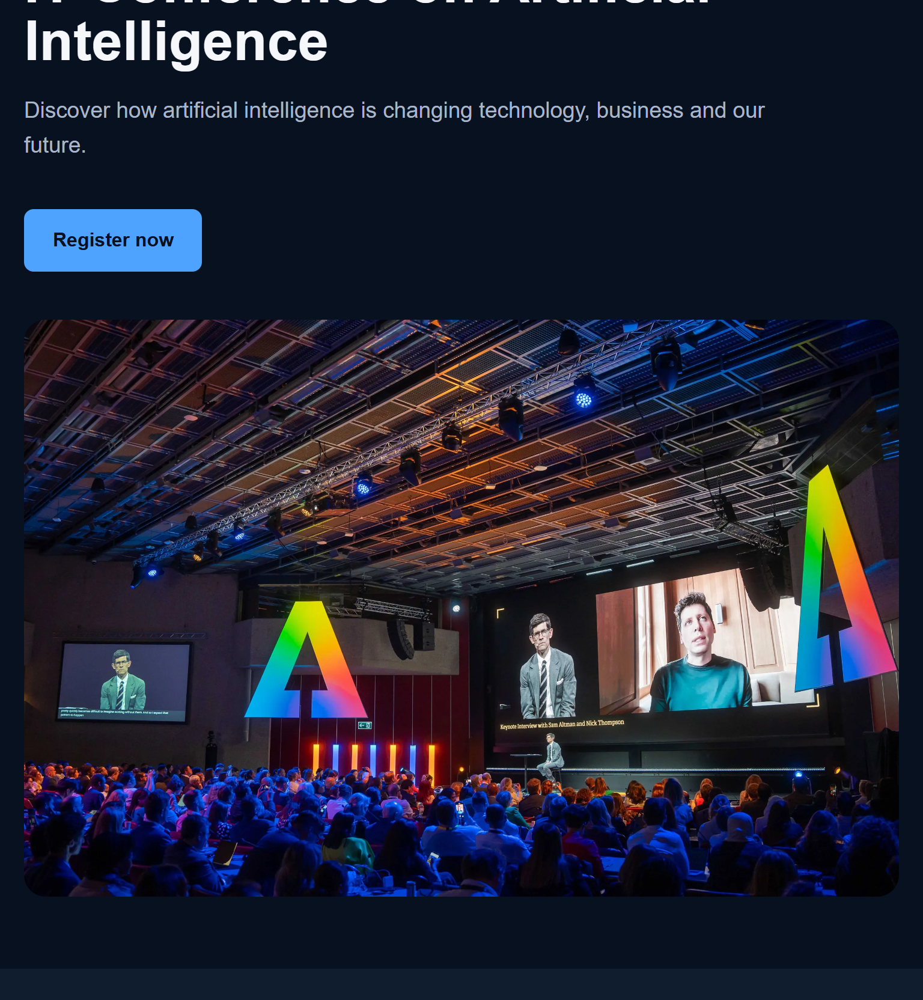
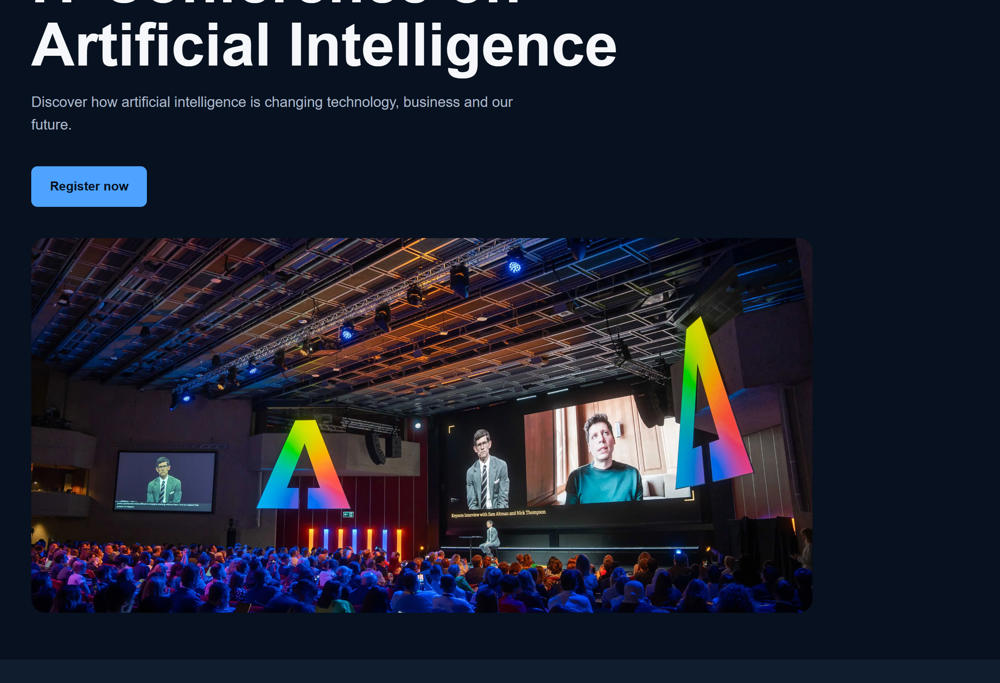

# AI Future 2026

AI Future 2026 is a landing page for an IT conference about Artificial Intelligence.

## Live Site

The website will be published using GitHub Pages.

## What I Did

- Created a semantic HTML5 structure.
- Added navigation, conference information, speakers and program sections.
- Created a registration form with labels and required fields.
- Added an image with alternative text for accessibility.
- Created a responsive layout for phone, tablet and desktop.
- Used modern CSS features including CSS variables, nesting, `clamp()` and container queries.

## Why This Tool

I used modern plain CSS without a framework for this project.
It gives me direct control over the design and responsive layout.
CSS variables make it easier to manage repeated values such as colors.
The `clamp()` function helps text adapt to different screen sizes.
CSS nesting makes the stylesheet easier to organize and read.
Container queries provide another way to create responsive components.
The disadvantage is that writing plain CSS can take more time than using a ready-made framework.

## Responsive

### Phone — 375px

### Tablet — 768px

### Desktop — 1280px

## AI Usage

I used ChatGPT to help me understand HTML, CSS, responsive design and Git commands. I reviewed the code and understand how the main parts of the project work.

## Author

Zhumabay Nurahmet  
IT1-2310